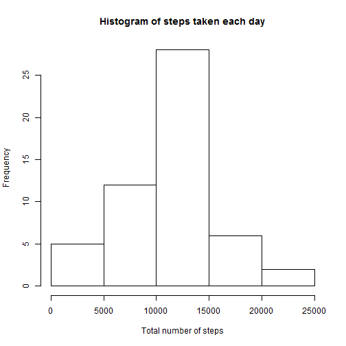
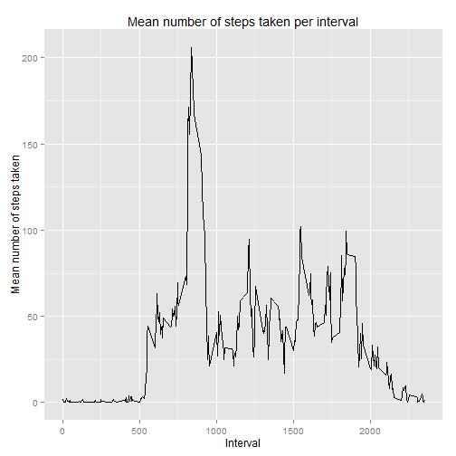
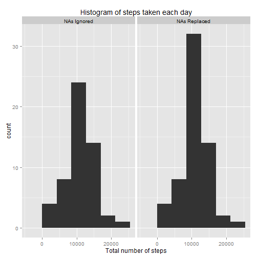
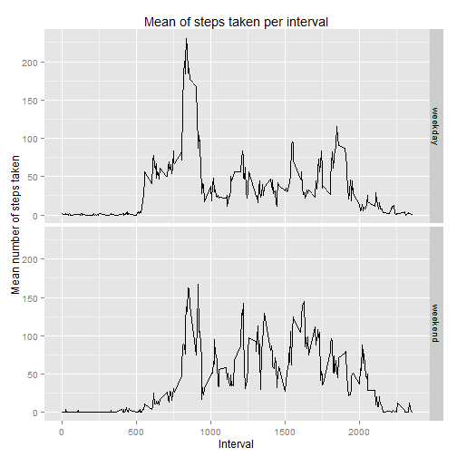

##Introduction

This is an analysis of a personal activity monitoring device which collects data at 5 minute intervals throughout the day. The data were collected from an anonymous individual during the months of October and November, 2012, and comprise the number of steps taken during each 5 minute interval.

##Analysis

###1: Load and Tidy the Data

The data were loaded and the dates converted to POSIXct format.


```r
act <- read.csv("C:/Users/Julianna Poole/Documents/activity.csv")
library(lubridate)
act$date <- ymd(act$date)
head(act)
```

```
##   steps       date interval
## 1    NA 2012-10-01        0
## 2    NA 2012-10-01        5
## 3    NA 2012-10-01       10
## 4    NA 2012-10-01       15
## 5    NA 2012-10-01       20
## 6    NA 2012-10-01       25
```

```r
class(act$date)
```

```
## [1] "POSIXct" "POSIXt"
```

###2: What is the mean total number of steps taken per day?

The total number of steps taken per day was calculated, and a histogram of the data was constucted.


```r
daysums <- aggregate(act[,"steps"], list(act$date), sum, na.rm = FALSE)
head(daysums)
```

```
##      Group.1     x
## 1 2012-10-01    NA
## 2 2012-10-02   126
## 3 2012-10-03 11352
## 4 2012-10-04 12116
## 5 2012-10-05 13294
## 6 2012-10-06 15420
```

```r
hist(daysums[,2],
     xlab="Total number of steps",
     main="Histogram of steps taken each day")
```

 

The mean and the median of the total number of steps taken per day were calculated.


```r
mean(daysums[,2], na.rm=TRUE)
```

```
## [1] 10766.19
```

```r
median(daysums[,2], na.rm=TRUE)
```

```
## [1] 10765
```

###3: What is the average daily activity pattern?

A time-series plot was constructed to view the number of steps taken, averaged across all days, for each 5-minute interval.


```r
intmean <- aggregate(act[,"steps"], list(act$interval), mean, na.rm = TRUE)
colnames(intmean) <- c("Interval", "Mean")
library(ggplot2)
ggplot(intmean, aes(Interval, Mean)) + geom_line() +
    labs(title="Mean number of steps taken per interval") +
    labs(x="Interval", y="Mean number of steps taken")
```

 

The interval with the maximum mean number of steps taken was determined.


```r
maxrow <- which.max(intmean$Mean)
intmean[maxrow,"Interval"]
```

```
## [1] 835
```

###4: Imputing missing values

Next, missing values (i.e. NAs) were dealt with. The total number of missing values was determined.


```r
sum(is.na(act$steps))
```

```
## [1] 2304
```

To eliminate missing values, a new dataset was constructed in which the missing values were replaced with the mean number of steps taken in the respective time intervals.


```r
actNA <- act
for(i in 1:nrow(actNA)) {
    if(is.na(actNA[i,"steps"])) {
        int <- actNA[i,"interval"]
        row <- which(intmean$Interval==int)
        actNA[i,"steps"] <- intmean[row,"Mean"]
    }
}
##With NAs
head(act)
```

```
##   steps       date interval
## 1    NA 2012-10-01        0
## 2    NA 2012-10-01        5
## 3    NA 2012-10-01       10
## 4    NA 2012-10-01       15
## 5    NA 2012-10-01       20
## 6    NA 2012-10-01       25
```

```r
##Without NAs
head(actNA)
```

```
##       steps       date interval
## 1 1.7169811 2012-10-01        0
## 2 0.3396226 2012-10-01        5
## 3 0.1320755 2012-10-01       10
## 4 0.1509434 2012-10-01       15
## 5 0.0754717 2012-10-01       20
## 6 2.0943396 2012-10-01       25
```

To compare the two datasets, histograms of each were constructed.


```r
daysums <- aggregate(act[,"steps"], list(act$date), sum, na.rm = FALSE)
r1 <- rep("NAs Ignored", times=nrow(daysums))
daysums <- cbind(daysums, r1)
colnames(daysums) <- c("Date","Sum","DF")
daysumsNA <- aggregate(actNA[,"steps"], list(actNA$date), sum, na.rm = FALSE)
r2 <- rep("NAs Replaced", times=nrow(daysums))
daysumsNA <- cbind(daysumsNA, r2)
colnames(daysumsNA) <- c("Date","Sum","DF")
ds <- rbind(daysums,daysumsNA)
ggplot(ds, aes(Sum)) + geom_histogram(binwidth = max(ds$Sum, na.rm=TRUE)/5) + facet_grid(. ~ DF) +
    labs(title="Histogram of steps taken each day") +
    labs(x="Total number of steps")
```

 

As seen above, the counts in the bins increased when missing values were replaced, but the overall shape of the histogram remained the same. 

Additionally, the means and medians of each dataset were calculated.


```r
daymean <- mean(daysums[,2], na.rm=TRUE)
daymeanNA <- mean(daysumsNA[,2], na.rm=TRUE)
daymean
```

```
## [1] 10766.19
```

```r
daymeanNA
```

```
## [1] 10766.19
```

```r
abs(daymean-daymeanNA)
```

```
## [1] 0
```

```r
daymedian <- median(daysums[,2], na.rm=TRUE)
daymedianNA <- median(daysumsNA[,2], na.rm=TRUE)
daymedian
```

```
## [1] 10765
```

```r
daymedianNA
```

```
## [1] 10766.19
```

```r
abs(daymedian-daymedianNA)
```

```
## [1] 1.188679
```

The mean, therefore, did not change when the missing values were replaced, and the median changed by <2 steps.

###5: Are there differences in activity patterns between weekdays and weekends?

To determine if the number of steps was different on weekdays vs. weekends, a plot was constructed to compare the average number of steps taken in each interval on the weekend and on weekdays.

First, the variable weekday/weekend was added to the data. To simplify, the dataset in which the missing values were replaced was used.


```r
DoW <- weekdays(actNA$date)
for(i in 1:length(DoW)) {
    if(DoW[i] %in% c("Monday", "Tuesday", "Wednesday", "Thursday", "Friday")) {
        DoW[i] <- "weekday"
    }
    if(DoW[i] %in% c("Saturday", "Sunday")) {
        DoW[i] <- "weekend"
    }
}
actNA2 <- cbind(actNA, DoW)
head(actNA2)
```

```
##       steps       date interval     DoW
## 1 1.7169811 2012-10-01        0 weekday
## 2 0.3396226 2012-10-01        5 weekday
## 3 0.1320755 2012-10-01       10 weekday
## 4 0.1509434 2012-10-01       15 weekday
## 5 0.0754717 2012-10-01       20 weekday
## 6 2.0943396 2012-10-01       25 weekday
```

Then the plots were constucted.


```r
intmeanNA <- aggregate(actNA2[,"steps"], list(actNA2$DoW,actNA2$interval), mean, na.rm = TRUE)
colnames(intmeanNA) <- c("DoW","Interval","Mean")
ggplot(intmeanNA, aes(Interval, Mean)) + geom_line() + facet_grid(DoW ~ .) +
    labs(title="Mean of steps taken per interval") +
    labs(x="Interval", y="Mean number of steps taken")
```

 
